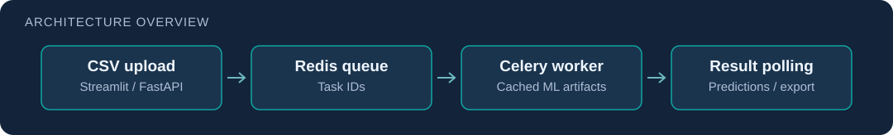

# RADCOM Cyber Classifier

**Network-traffic classification with an asynchronous inference API and a browser interface.**

Co-built by **Dor Cohen and Baruh Ifraimov**, as credited in the application. The project combines application/attribution feature engineering and ensemble models with an independently queued prediction service.



## What the system does

1. A user uploads CSV traffic data from Streamlit or the FastAPI endpoint.
2. `POST /predict/{task_type}` creates a Celery job and returns its `task_id`.
3. A worker builds features, aligns/scales inputs against fitted artifacts, and runs the selected model.
4. `GET /result/{task_id}` reports status and returns predictions when ready; the UI exports them as CSV.

**Stack:** Python · FastAPI · Celery · Redis · Streamlit · pandas · scikit-learn · XGBoost · Docker.

## Engineering to inspect

| Component | Evidence |
| --- | --- |
| API and task boundary | [app/api.py](app/api.py) |
| Inference, feature alignment, and artifact caching | [app/tasks.py](app/tasks.py) |
| Application-classification features and ensemble | [app_model.py](app_model.py) |
| Attribution-classification features and ensemble | [att_model.py](att_model.py) |
| Browser upload and results | [app/streamlit_app.py](app/streamlit_app.py) |
| Service orchestration | [docker-compose.yml](docker-compose.yml) |

My contribution spans the collaborative ML pipeline and application/service integration. This portfolio does not claim sole authorship of the shared models or a measured production deployment.

## Setup and artifact requirements

**Training data and fitted models are excluded from Git.** You need authorized input data in `data/APP-1/` and `data/attribution/`, then model artifacts in `models/`. The detailed [training guide](docs/TRAINING.md) explains the two pipelines and plot generation.

```bash
python -m venv .venv
# Activate your virtual environment, then:
pip install -r requirements.txt
# After supplying the expected training data:
python app_model.py
python att_model.py
docker compose up --build
```

Open `http://localhost:8501` for Streamlit or `http://localhost:8000/docs` for the API. The worker loads artifacts from the mounted `/models` directory, including `{app,att}_model.pkl` and optional scaler, label-encoder, and feature-column files. A source-only clone cannot complete predictions without those artifacts.

Example API workflow with your own compatible CSV:

```bash
curl -F "file=@traffic.csv" http://localhost:8000/predict/app
curl http://localhost:8000/result/YOUR_TASK_ID
```

## Limits and evaluation

- This is a project service, with no public multi-user authentication, upload-size policy, or rate limiting. Keep it in an isolated development environment.
- Task IDs and polling decouple request handling from model processing; they do not guarantee throughput or exactly-once execution.
- Accuracy depends on the dataset, split, feature processing, and fitted artifacts. No unsupported accuracy or benchmark figure is published here.
- Prediction/data artifacts and logs remain private. Load only model files from a trusted source; serialized Python model artifacts are executable trust inputs.

[Training and original project detail](docs/TRAINING.md)
